<!-- Improved compatibility of back to top link: See: https://github.com/othneildrew/Best-README-Template/pull/73 -->
<a name="readme-top"></a>
<!--
*** Thanks for checking out the Best-README-Template. If you have a suggestion
*** that would make this better, please fork the repo and create a pull request
*** or simply open an issue with the tag "enhancement".
*** Don't forget to give the project a star!
*** Thanks again! Now go create something AMAZING! :D
-->


<!-- PROJECT SHIELDS -->
<!--
*** I'm using markdown "reference style" links for readability.
*** Reference links are enclosed in brackets [ ] instead of parentheses ( ).
*** See the bottom of this document for the declaration of the reference variables
*** for contributors-url, forks-url, etc. This is an optional, concise syntax you may use.
*** https://www.markdownguide.org/basic-syntax/#reference-style-links
-->
<div align="center">

  [![Contributors][contributors-shield]][contributors-url]
  [![Forks][forks-shield]][forks-url]
  [![Stargazers][stars-shield]][stars-url]
  [![Issues][issues-shield]][issues-url]
  [![MIT License][license-shield]][license-url]

</div>

<!-- PROJECT LOGO -->
<br />
<div align="center">
  <a href="https://github.com/UtkuAltnkaya/HeroOfTheArena">
    
  </a>

  <h3 align="center">HERO OF THE ARENA</h3>
  <p align="center">
    A Turn-based Game  
    <br />
    <a href="https://github.com/UtkuAltnkaya/HeroOfTheArena"><strong>Explore the docs »</strong></a>
    <br />
    <br />
    <a href="https://github.com/UtkuAltnkaya/HeroOfTheArena">View Demo</a>
    ·
    <a href="https://github.com/UtkuAltnkaya/HeroOfTheArena/issues">Report Bug</a>
    ·
    <a href="https://github.com/UtkuAltnkaya/HeroOfTheArena/issues">Request Feature</a>
  </p>
</div>

<!-- CREATORS -->
<br/>

<h1 align="center">Creators</h1>

<table width="100%">
  <tr>
    <td align ="center"><a href="https://github.com/alperrkilic"></a></td>
    <td align ="center"><a href="https://github.com/UtkuAltnkaya"></a></td>
    <td align ="center"><a href="https://github.com/AtesBurak1"></a></td>
  </tr>
  <tr>
    <td align="center">Bayram Alper KILIÇ</td>
    <td align="center">Utku ALTINKAYA</td>
    <td align="center">Burak ATEŞ</td>
  </tr>
</table>

<br/>
<br/>

<!-- product image -->
<div style="margin-top:50px" align ="center">
    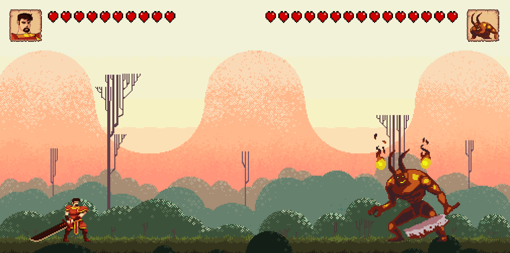
</div>


<!-- TABLE OF CONTENTS -->
<details>
  <summary>Table of Contents</summary>
  <ol>
    <li>
      <a href="#about-the-project">About The Project</a>
      <ul>
        <li><a href="#built-with">Built With</a></li>
      </ul>
    </li>
    <li>
      <a href="#getting-started">Getting Started</a>
      <ul>
        <li><a href="#prerequisites">Prerequisites</a></li>
        <li><a href="#installation">Installation</a></li>
      </ul>
    </li>
    <li><a href="#gameplay">Gameplay</a></li>
    <li><a href="#contributing">Contributing</a></li>
    <li><a href="#license">License</a></li>
    <li><a href="#contact">Contact</a></li>
    <li><a href="#acknowledgments">Acknowledgments</a></li>
  </ol>
</details>


<!-- ABOUT THE PROJECT -->
## About The Project

There are many great README templates available on GitHub; however, I didn't find one that really suited my needs so I created this enhanced one. I want to create a README template so amazing that it'll be the last one you ever need -- I think this is it.

Here's why:
* Your time should be focused on creating something amazing. A project that solves a problem and helps others
* You shouldn't be doing the same tasks over and over like creating a README from scratch
* You should implement DRY principles to the rest of your life :smile:

Of course, no one template will serve all projects since your needs may be different. So I'll be adding more in the near future. You may also suggest changes by forking this repo and creating a pull request or opening an issue. Thanks to all the people have contributed to expanding this template!


<p align="right">(<a href="#readme-top">back to top</a>)</p>


### Built With

Hero Of The Arena is made with C++ and SFML. No such game engine was used in the project, so all animations, physics and logic were done manually. Over 200 hours were spent producing the game.

* <a href="https://cplusplus.com/">
    
</a>

* [![SFML][SFML]][SFML-url]

<p align="right">(<a href="#readme-top">back to top</a>)</p>


<!-- GETTING STARTED -->
## Getting Started

This is an example of how you may give instructions on setting up your project locally.
To get a local copy up and running follow these simple example steps.

### Prerequisites

This is an example of how to list things you need to use the software and how to install them.
* g++
  ```sh
  https://gcc.gnu.org/
  ```

### Installation

_Below is an example of how you can instruct your audience on installing and setting up your app. This template doesn't rely on any external dependencies or services._

-  Download
<!--  [https://example.com](https://example.com) -->
<!-- 2. Clone the repo
   ```sh
   git clone https://github.com/your_username_/Project-Name.git
   ```
3. Install NPM packages
   ```sh
   npm install
   ```
4. Enter your API in `config.js`
   ```js
   const API_KEY = 'ENTER YOUR API';
   ```

<p align="right">(<a href="#readme-top">back to top</a>)</p> -->


<!-- USAGE EXAMPLES -->
## Gameplay

Below you can find some of the UI and character skills. Music options, store and character selection are available for the UI. There is a chance to beat the boss with the purchased items, but the character will most likely die if the wrong items are bought. As for the characters, each character has 3 attack skills, one special attack (R) and the other two basic attack (Q,W). Special Attack can't be used often as it consumes more mana than other skills. Each turn regenerates the character's mana so that the special attack becomes available. On some rounds, attacking may not be the best option. Therefore, you can choose defense (E) for a Turn to regenerate mana for the special attack.

<br/>
<br/>

<h1 align="center">User Interface</h1>

<table>
  <tr>
        <td align ="center">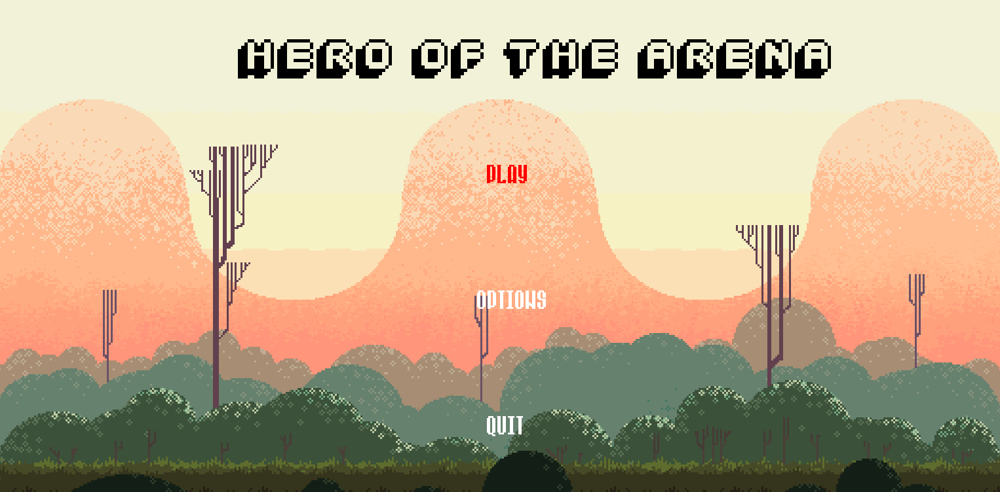</img></td>
        <td align ="center">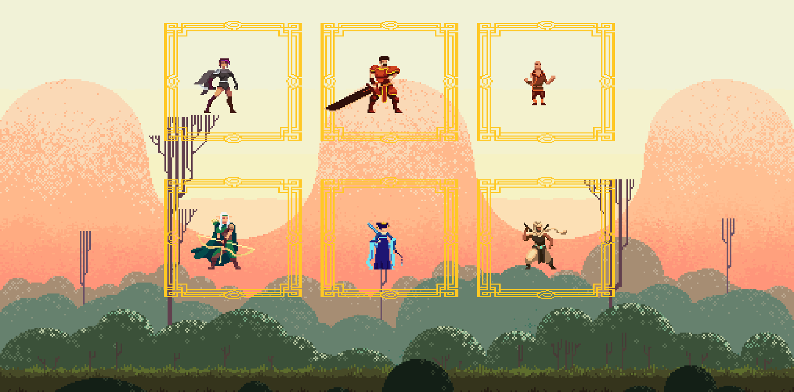</img></td>
  </tr>
  <tr>
        <td align ="center">Main Menu</td>
        <td align ="center">Character Menu</td>
  </tr>
    <tr>
        <td align ="center">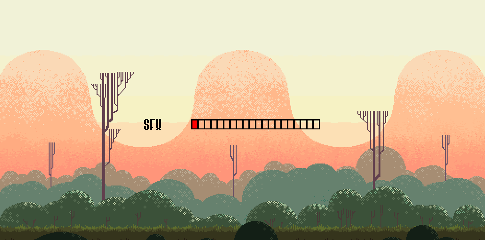</img></td>
        <td align ="center">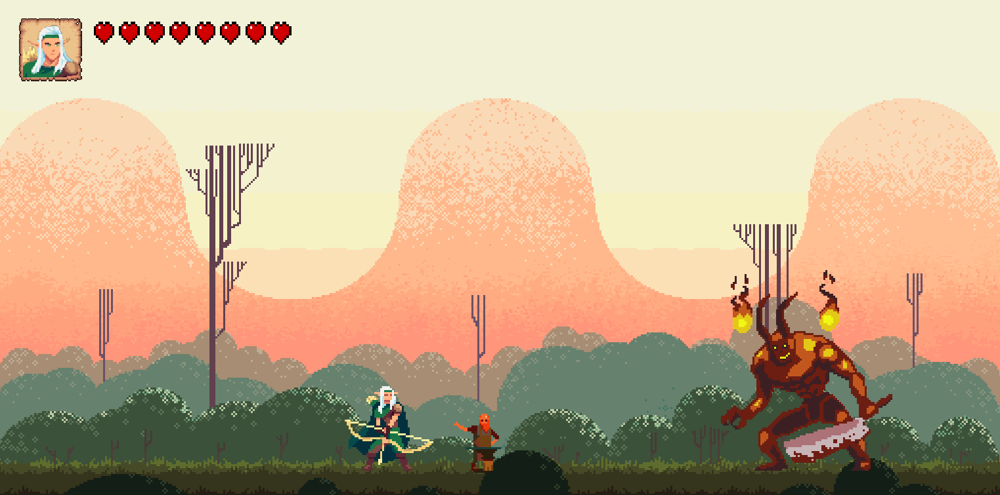</img></td>
  </tr>
  <tr>
        <td align ="center">Options</td>
        <td align ="center">Shop</td>
  </tr>
</table>

</br>
</br>

<h1 align="center">Character Animations</h1>

<table>
      <tr>
        <td align ="center">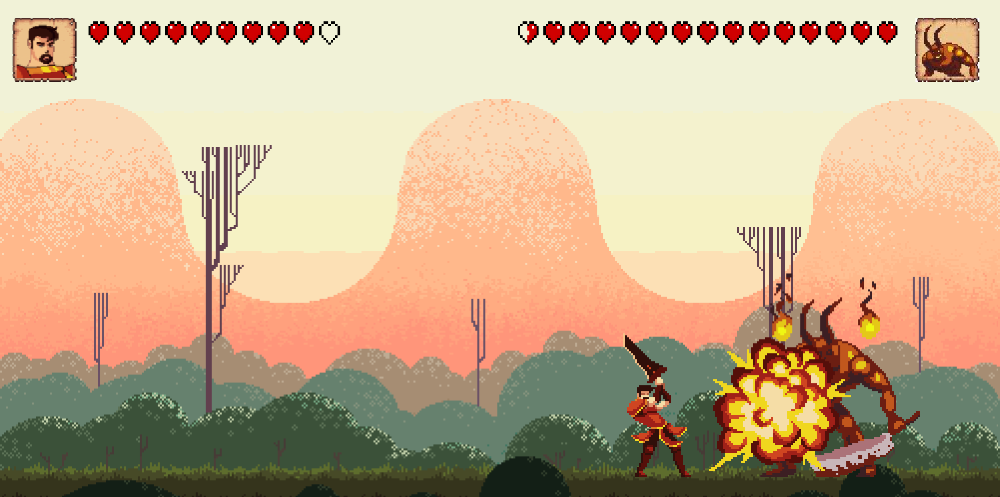</img></td>
        <td align ="center">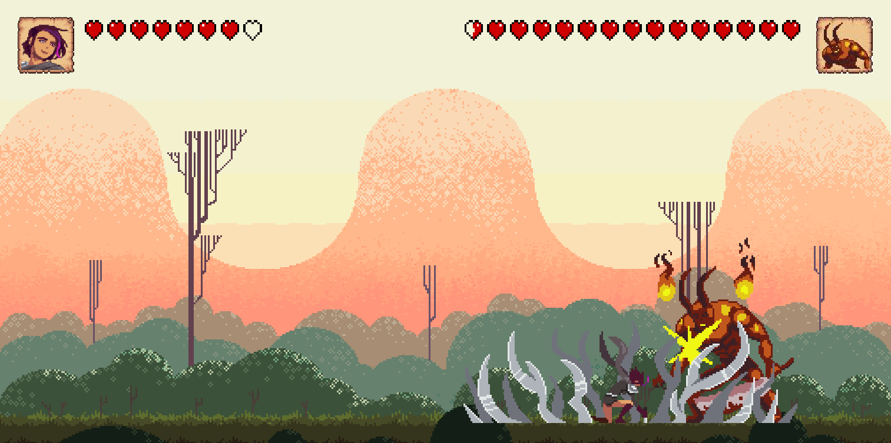</img></td>
  </tr>
  <tr>
        <td align ="center">Fire Knight</td>
        <td align ="center">Blade Keeper</td>
  </tr>
  <tr>
        <td align ="center">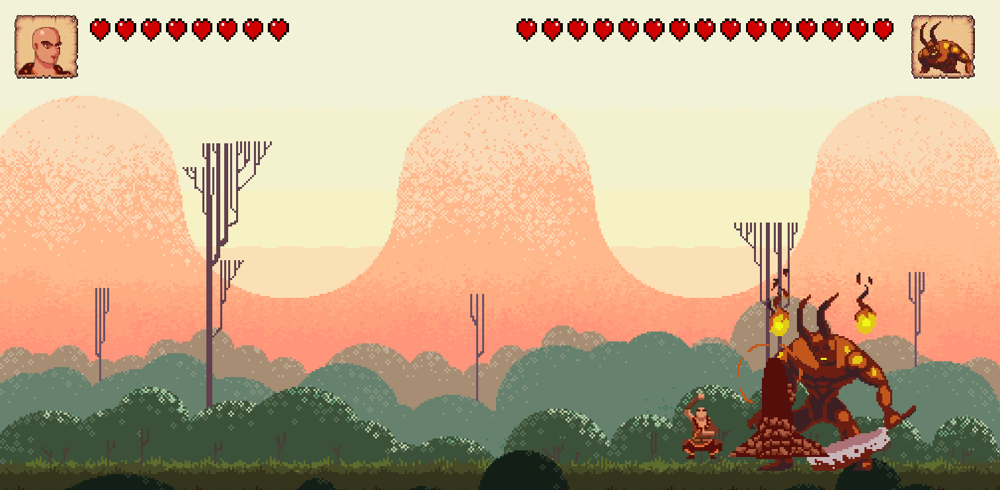</img></td>
        <td align ="center">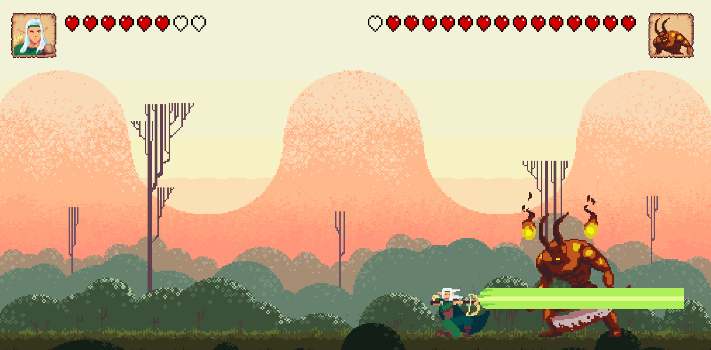</img></td>
  </tr>
  <tr>
        <td align ="center">Ground Monk</td>
        <td align ="center">Leaf Arhcer</td>
  </tr>
  <tr>
        <td align ="center">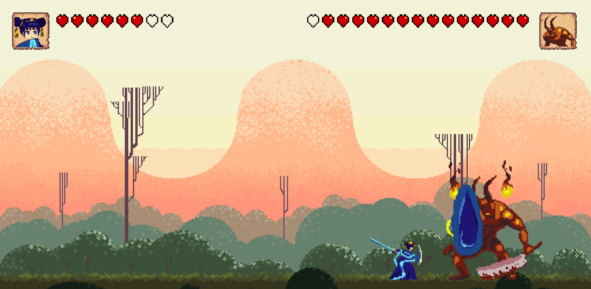</img></td>
        <td align ="center">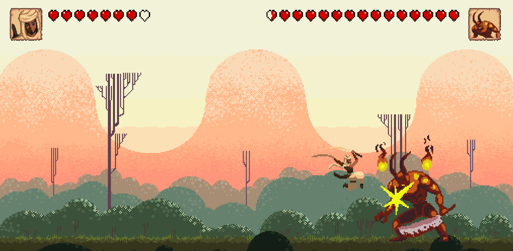</img></td>
  </tr>
  <tr>
        <td align ="center">Water</td>
        <td align ="center">Wind</td>
  </tr>
</table>

_For more examples, please visit the [HOTA Website](https://example.com)_

<!-- <p align="right">(<a href="#readme-top">back to top</a>)</p> -->
<!-- CONTRIBUTING -->
<!-- ## Contributing

Contributions are what make the open source community such an amazing place to learn, inspire, and create. Any contributions you make are **greatly appreciated**.

If you have a suggestion that would make this better, please fork the repo and create a pull request. You can also simply open an issue with the tag "enhancement".
Don't forget to give the project a star! Thanks again!

1. Fork the Project
2. Create your Feature Branch (`git checkout -b feature/AmazingFeature`)
3. Commit your Changes (`git commit -m 'Add some AmazingFeature'`)
4. Push to the Branch (`git push origin feature/AmazingFeature`)
5. Open a Pull Request -->

<p align="right">(<a href="#readme-top">back to top</a>)</p>


<!-- LICENSE -->
## License

Distributed under the GPL-3.0 License. See `LICENSE.txt` for more information.

<p align="right">(<a href="#readme-top">back to top</a>)</p>


<!-- CONTACT -->
## Contact

Bayram Alper KILIÇ - alperkilicbusiness@gmail.com

Utku ALTINKAYA - email@example.com

Burak ATEŞ - burakates2011@hotmail.com


<p align="right">(<a href="#readme-top">back to top</a>)</p>


<!-- ACKNOWLEDGMENTS -->
## Acknowledgments

Use this space to list resources you find helpful and would like to give credit to. I've included a few of my favorites to kick things off!

* [Choose an Open Source License](https://choosealicense.com)
* [GitHub Emoji Cheat Sheet](https://www.webpagefx.com/tools/emoji-cheat-sheet)
* [Malven's Flexbox Cheatsheet](https://flexbox.malven.co/)
* [Malven's Grid Cheatsheet](https://grid.malven.co/)
* [Img Shields](https://shields.io)
* [GitHub Pages](https://pages.github.com)
* [Font Awesome](https://fontawesome.com)
* [React Icons](https://react-icons.github.io/react-icons/search)

<p align="right">(<a href="#readme-top">back to top</a>)</p>


<!-- MARKDOWN LINKS & IMAGES -->
<!-- https://www.markdownguide.org/basic-syntax/#reference-style-links -->
[contributors-shield]: https://img.shields.io/github/contributors/UtkuAltnkaya/HeroOfTheArena.svg?style=for-the-badge 
[contributors-url]:https://github.com/UtkuAltnkaya/HeroOfTheArena/graphs/contributors
[forks-shield]: https://img.shields.io/github/forks/UtkuAltnkaya/HeroOfTheArena.svg?style=for-the-badge
[forks-url]: https://github.com/UtkuAltnkaya/HeroOfTheArena/network/members
[stars-shield]: https://img.shields.io/github/stars/UtkuAltnkaya/HeroOfTheArena.svg?style=for-the-badge
[stars-url]: https://github.com/UtkuAltnkaya/HeroOfTheArena/stargazers
[issues-shield]: https://img.shields.io/github/issues/UtkuAltnkaya/HeroOfTheArena.svg?style=for-the-badge
[issues-url]: https://github.com/UtkuAltnkaya/HeroOfTheArena/issues
[license-shield]: https://img.shields.io/github/license/UtkuAltnkaya/HeroOfTheArena.svg?style=for-the-badge
[license-url]: https://github.com/UtkuAltnkaya/HeroOfTheArena/blob/main/LICENSE

[SFML]: https://img.shields.io/badge/SFML-ffffff?style=for-the-badge&logo=sfml&logoColor=green
[SFML-url]: https://www.sfml-dev.org/

